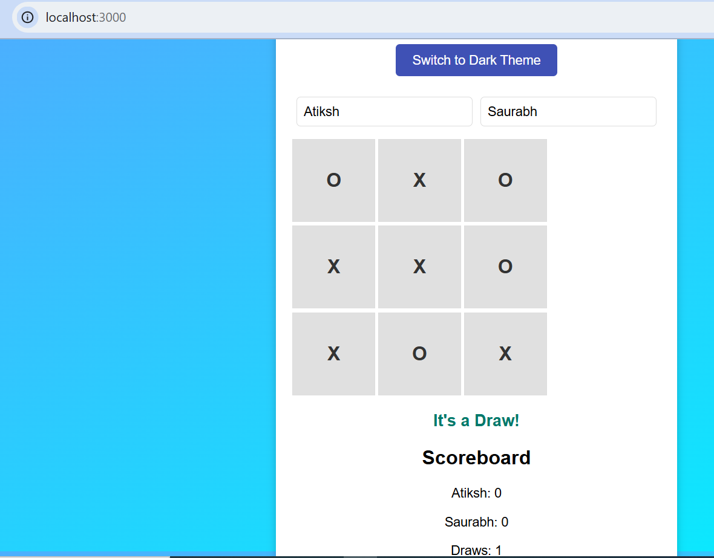
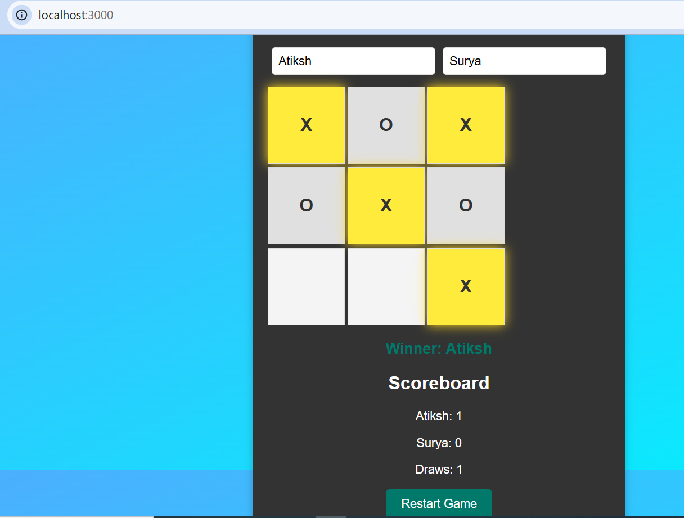

# Tic-Tac-Toe Game

A modern, interactive, and responsive Tic-Tac-Toe game built with React. This game allows players to enter custom names, keeps track of scores across multiple rounds, supports theme switching, and includes animations for a better user experience.

## 🚀 Features

- 🎨 **Light & Dark Theme**: Switch between themes for a customized experience.
- 🎭 **Animated UI**: Smooth animations enhance gameplay interactions.
- 🏆 **Score Tracking**: Keeps track of individual player wins and draws.
- 👥 **Custom Player Names**: Players can enter their names before playing.
- 🔄 **Responsive Design**: Works on both desktop and mobile screens.
- ✅ **Fully Tested**: Includes unit tests to ensure reliability.

## 📦 Project Structure (primary)

```
/tic-tac-toe-ui
├── /public
│   ├── index.html
│   ├── favicon.ico
├── /src
│   ├── /components
│   │   ├── TicTacToe.js
│   ├── /styles
│   │   ├── App.css
│   ├── /tests
│   │   ├── TicTacToe.test.js
│   ├── index.js
│   ├── setupTests.js
└── package.json
```

## 🛠 Installation

1. Clone this repository:
   ```bash
   git clone https://github.com/bondsaurabh/tic-tac-toe-ui.git
   cd tic-tac-toe-ui
   ```
2. Install dependencies:
   ```bash
   npm install
   ```
3. Start the development server:
   ```bash
   npm start
   ```
4. Run tests:
   ```bash
   npm test
   ```
## Game Screenshots
Light Theme:



Dark theme with score card:



## 🤝 Contributing

We welcome contributions! If you'd like to improve the game, follow these steps:

1. Fork the repository.
2. Create a new branch: `git checkout -b feature-name`
3. Make your changes and commit: `git commit -m "Add new feature"`
4. Push to the branch: `git push origin feature-name`
5. Submit a pull request.

## 📝 License

This project is open-source and available under the MIT License.
